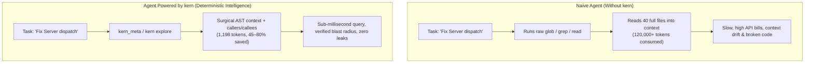
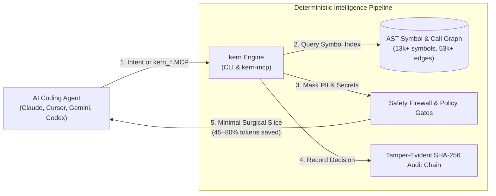

<div align="center">

# kern

### The local, deterministic code-intelligence engine for AI agents

**Index · Graph · Guard · Audit · Optimize — One self-contained CLI binary, zero network, no telemetry.**

[](LICENSE)
[](https://go.dev/)
[](#telemetry--privacy)
[](#telemetry--privacy)
[-brightgreen.svg)](#how-it-works)

[](#supported-agents)
[](#supported-agents)
[](#supported-agents)
[](#supported-agents)
[](#supported-agents)
[](#supported-agents)

<br>

[**Quickstart**](#quickstart) •
[**Why kern?**](#why-kern) •
[**Benchmarks**](#benchmark-results) •
[**MCP Setup**](#connect-to-your-agent) •
[**How It Works**](#how-it-works) •
[**Documentation**](#docs)

<br>

**17 Indexed Languages · 74 Frameworks Recognized · Phase-aware MCP Routing · 100% Local**

</div>

---

## The Problem: The AI Agent Context Crisis

When AI coding agents navigate codebases with traditional tools (`grep`, `find`, `cat`, or naive file reads), they hit four critical bottlenecks:
1. **Context Bloat:** Reading 20–50 full files to understand one function burns **50,000–150,000+ tokens** before any edit begins.
2. **Hallucinated Dependencies:** Blind regex searches miss indirect call edges, inheritance hierarchies, and cross-package references.
3. **Slow Iteration:** Walking disk trees over and over wastes seconds per turn.
4. **Privacy Leaks:** Raw source files and noisy logs leak secrets and API keys directly into LLM prompts.



---

## Traditional Agent vs. Agent + kern

| Dimension | Traditional Agent (`grep` / `read` / `glob`) | Agent Powered by `kern` |
|---|---|---|
| **Token Consumption** | 50,000 – 150,000+ tokens per deep task | **500 – 2,500 tokens** (minimal surgical symbol slices) |
| **Search Latency** | 2 – 15 seconds walking disk trees | **< 10ms** pre-indexed AST & symbol cache |
| **Code Understanding** | Flat string/regex pattern matching | **Precise AST call graphs, callers, callees & inheritance** |
| **Blast Radius & Risk** | Agent guesses dependencies | **Deterministic change impact & test coverage gaps** |
| **Security & Privacy** | Prompts send raw secrets to LLM | **100% local, automatic PII/secret masking, sandboxed execution** |
| **Governance & Audit** | Zero auditability | **Tamper-evident SHA-256 hash chain & cryptographic proofs** |

---

## Quickstart

### 1. Install

One command, prebuilt static binary (no runtime required):

```bash
# macOS / Linux
curl -fsSL https://raw.githubusercontent.com/JayveerPrajapati/kern/main/install.sh | sh

# Windows (PowerShell)
powershell -ExecutionPolicy Bypass -c "irm https://raw.githubusercontent.com/JayveerPrajapati/kern/main/install.ps1 | iex"
```

<details>
<summary><b>Other install options (Homebrew, Go install, Source)</b></summary>

```bash
# Homebrew
brew install --build-from-source ./homebrew/kern.rb

# Go Install (Go 1.25+)
go install github.com/JayveerPrajapati/kern/cmd/kern@latest
go install github.com/JayveerPrajapati/kern/cmd/kern-mcp@latest

# Build from source
make build  # Produces bin/kern, bin/kern-mcp, bin/kern-server
```
</details>

### 2. Connect to Your Agent

Auto-configure Claude Code, Cursor, Gemini CLI, Codex, VS Code, Windsurf, and all MCP clients:

```bash
kern setup
```

### 3. Initialize & Index

```bash
cd your-project
kern index .        # Fast one-shot AST indexing
kern watch .        # Auto-sync index on file changes
```

### 4. Ask Your Agent Anything

Ask your connected AI agent naturally:
> *"What breaks if I change `Server.dispatch`? Who depends on it, and why?"*

`kern` answers from the prebuilt index instantly — no file-by-file scanning.

---

## Benchmark Results

Reproducible on any machine — `go run ./evaluate/bench` (or `make bench`), fixed inline corpora, no network:

| Operation | Before | After | Token Reduction | Note |
|---|---|---|---|---|
| **Optimize Prompt** | 213 tokens | 142 tokens | **33.3%** | Deterministic, keeps code/paths |
| **Optimize Log** | 176 tokens | 69 tokens | **60.8%** | Preserves errors + stack frames |
| **Output Compression (Terse)** | 208 tokens | 193 tokens | **7.2%** | Strips conversational filler |
| **Budget Fit (40 tok)** | 176 tokens | 32 tokens | **81.8%** | Delivers essential head + key lines |

**Retrieval recall:** **100% (3/3)** at recall@5 on the index benchmark harness.

---

## How It Works



1. **Extraction & Indexing** — `go/ast` parses Go precisely; a zero-dependency heuristic extractor covers 16 more languages; `-tags treesitter` adds deep tree-sitter grammars for 14 languages.
2. **Deterministic Storage** — Content-hash-verified index cached under `~/.cache/kern/`. `-tags sqlite` provides SQLite WAL + FTS5 full-text search.
3. **Deep Graph Intelligence** — 90+ CLI commands and MCP tools compute call graphs, blast radius, change impact, dead code, hotspots, and architecture boundaries.
4. **Autonomous Auto-Sync** — File-event watchers (inotifywait/fswatch + polling fallback) update the index on save, backed by staleness checks on every read.

---

## Connect to Your Agent

`kern setup` connects to 17 MCP clients automatically. To configure manually:

<details open>
<summary><b>Claude Code</b></summary>

```bash
claude mcp add kern -- kern mcp
```
</details>

<details open>
<summary><b>Cursor / VS Code (.mcp.json)</b></summary>

Add to your project's `.mcp.json`:
```json
{
  "mcpServers": {
    "kern": { "command": "kern", "args": ["mcp"] }
  }
}
```
</details>

<details>
<summary><b>Codex, Gemini CLI, Windsurf, Zed, Continue</b></summary>

Run `kern setup` or check [`docs/mcp-client.md`](docs/mcp-client.md) for custom JSON adapter instructions.
</details>

---

## MCP Tools & Routing

By default, `kern` advertises a **focused 11-tool high-level surface** routed through the smart **`kern_meta`** natural-language dispatcher.

| Core Tool | Purpose | What it Replaces |
|---|---|---|
| **`kern_meta`** | Single natural-language entry point — routes to the right tool automatically | Guessing tools |
| **`kern_search`** | Sub-millisecond AST symbol search by name, route, or prose | `grep` / `find` |
| **`kern_context`** | Minimal relevant source slice for a symbol (definition + callers + callees) | `cat` / `read` |
| **`kern_explore`** | Full symbol call hierarchy, callers, callees, and blast radius | Manual file crawls |
| **`kern_impact`** | Predicts blast radius, risk rating, and test gaps before changing code | Guesswork refactoring |
| **`kern_plan`** | Deterministic multi-file implementation plan for a proposed change | Ad-hoc edits |
| **`kern_review`** | Token-optimized code review context for diffs and pull requests | Whole-file diff reviews |
| **`kern_authorize_context`** | Computes authorized symbol context with cryptographic access proof | Unchecked file access |
| **`kern_optimize_prompt`** | Strips boilerplate and masks secrets before sending prompts | Unsafe prompt leaks |

*Set `KERN_MCP_FULL=1` to expose the entire 136-tool catalog, or `KERN_MCP_PHASE=explore|plan|edit|verify` to filter by active agent phase.*

---

## CLI Highlights

```bash
# Exploration & Context
kern explore <symbol>     # Definition + callers + callees + blast radius
kern why <symbol>         # Rationale & dependent symbols
kern context <symbol>     # Minimal source slice
kern search <query>       # Instant ranked AST symbol search

# Change Impact & Review
kern impact <symbol>      # Transitive blast radius & risk level
kern review               # Review unstaged/staged git changes against the index
kern guard                # Verify architecture boundaries

# Diagnostics & Optimization
kern doctor               # Verify binary, agent configs, and index health
kern optimize <prompt>    # Strip filler and mask secrets
kern stats                # Track cumulative local token & cost savings
```

See [`docs/cli-reference.md`](docs/cli-reference.md) for the full 90+ command guide.

---

## Supported Ecosystem

<details open>
<summary><b>Supported Languages (17)</b></summary>

Go · Python · JavaScript (JSX) · TypeScript (TSX) · Rust · C · C++ · C# · Java · Ruby · PHP · Shell · CSS/SCSS/Less · HTML · Markdown · JSON · YAML

*SFCs (Vue, Svelte, Astro) extract `<script>` blocks automatically. 14 languages support deep tree-sitter grammars via `-tags treesitter`.*
</details>

<details>
<summary><b>Recognized Frameworks (74)</b></summary>

Spring Boot, Django, FastAPI, Flask, Express, NestJS, Rails, Laravel, Gin, Echo, Fiber, Next.js, Nuxt, and 61 more. Run `kern fw --catalog` for the complete catalog.
</details>

<details>
<summary><b>Supported Agents & Platforms</b></summary>

- **Agents:** opencode, Claude Code, Cursor, Codex, Gemini CLI, VS Code, Windsurf, Zed, Antigravity, GitHub Copilot, Continue, Qwen, Qoder, Kiro.
- **Platforms:** Linux (amd64, arm64), macOS (Apple Silicon, Intel), Windows (amd64).
</details>

---

<details>
<summary><b>Diagnostics (`kern doctor`) Output Example</b></summary>

```text
# kern doctor — .

[ok] AGENTS.md rules        kern entry present
[ok] binary                 /Users/dev/.local/bin/kern
[ok] binary-exec            /Users/dev/.local/bin/kern-mcp runs
[ok] capabilities           sqlite: on (persistent index + FTS5) · treesitter: on
[ok] claude                 kern MCP registered
[ok] cursor                 kern entry present
[ok] freshness              index is fresh (13080 symbols, 53520 call edges)
[ok] precision              all 11 languages at AST-or-better precision
[ok] stats                  3720 ops, 831436 tokens saved (19.9%)

verdict: all systems operational
```
</details>

<details>
<summary><b>Security & Privacy Posture</b></summary>

- **Zero Telemetry:** No tracking, no metrics uploaded, no background pings.
- **Fail-Closed Execution:** Host commands blocked unless explicitly allowlisted (`KERN_ALLOW_EXEC=1`).
- **Secret & PII Masking:** Automatically sanitizes AWS keys, tokens, and credentials.
- **Workspace Confinement:** Tool operations confined to workspace roots (`KERN_MCP_ROOTS`).
</details>

---

## Docs

- [`docs/cli-reference.md`](docs/cli-reference.md) — Complete 90+ CLI command reference.
- [`docs/tool-catalog.md`](docs/tool-catalog.md) — Full generated MCP tool catalog (136 tools).
- [`docs/configuration.md`](docs/configuration.md) — Configuration and environment variables.
- [`docs/privacy.md`](docs/privacy.md) — Security and privacy specifications.
- [`docs/authorized-context.md`](docs/authorized-context.md) — Authorized-context & governance proofs.
- [`docs/skills.md`](docs/skills.md) — Bundled agent skills & runbooks.
- [`docs/benchmarks/`](docs/benchmarks/) — Benchmark harness and corpora.

---

## Stargazers & Community

If `kern` saves you context tokens, speed, or money, **give it a star ⭐ on GitHub**!

[](https://github.com/JayveerPrajapati/kern)

---

## License

[MIT](LICENSE) © 2026 Jayveer Prajapati