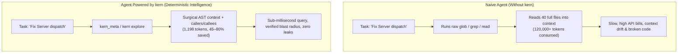

<div align="center">

# kern

### The local, deterministic code-intelligence engine for AI agents

**Index · Graph · Guard · Audit · Optimize — One self-contained CLI binary. Local-first, no telemetry.**

[](LICENSE)
[](https://go.dev/)
[](#traditional-agent-vs-agent--kern)
[](#traditional-agent-vs-agent--kern)
[-brightgreen.svg)](#how-it-works)

[](#supported-ecosystem)
[](#supported-ecosystem)
[](#supported-ecosystem)
[](#supported-ecosystem)
[](#supported-ecosystem)
[](#supported-ecosystem)

<br>

[**Quickstart**](#quickstart) •
[**Why kern?**](#the-problem-the-ai-agent-context-crisis) •
[**Benchmarks**](#benchmark-results) •
[**SDKs**](#sdks) •
[**MCP Setup**](#connect-to-your-agent) •
[**How It Works**](#how-it-works) •
[**Documentation**](#docs)

<br>

**17 Indexed Languages · 74 Frameworks Recognized · Phase-aware MCP Routing (11 high-level tools by default, 139 in full mode) · 100% Local**

</div>

---

## The Problem: The AI Agent Context Crisis

When AI coding agents navigate codebases with traditional tools (`grep`, `find`, `cat`, or naive file reads), they hit four critical bottlenecks:
1. **Context Bloat:** Reading 20–50 full files to understand one function burns **50,000–150,000+ tokens** before any edit begins.
2. **Hallucinated Dependencies:** Blind regex searches miss indirect call edges, inheritance hierarchies, and cross-package references.
3. **Slow Iteration:** Walking disk trees over and over wastes seconds per turn.
4. **Privacy Leaks:** Raw source files and noisy logs leak secrets and API keys directly into LLM prompts.



---

## Traditional Agent vs. Agent + kern

| Dimension | Traditional Agent (`grep` / `read` / `glob`) | Agent Powered by `kern` |
|---|---|---|
| **Token Consumption** | 50,000 – 150,000+ tokens per deep task | **500 – 2,500 tokens** (minimal surgical symbol slices) |
| **Search Latency** | 2 – 15 seconds walking disk trees | **< 10ms** pre-indexed AST & symbol cache |
| **Code Understanding** | Flat string/regex pattern matching | **Precise AST call graphs, callers, callees & inheritance** |
| **Blast Radius & Risk** | Agent guesses dependencies | **Deterministic change impact & test coverage gaps** |
| **Security & Privacy** | Prompts send raw secrets to LLM | **100% local, automatic PII/secret masking, sandboxed execution** |
| **Governance & Audit** | Zero auditability | **Tamper-evident SHA-256 hash chain & cryptographic proofs** |

---

## Quickstart

### 1. Install

One command, prebuilt static binary (no runtime required):

```bash
# macOS / Linux
curl -fsSL https://raw.githubusercontent.com/JayveerPrajapati/kern/main/install.sh | sh

# Windows (PowerShell)
powershell -ExecutionPolicy Bypass -c "irm https://raw.githubusercontent.com/JayveerPrajapati/kern/main/install.ps1 | iex"
```

The installer prints every step as it completes (platform detection → release
resolution → download → checksum verification → install → macOS Gatekeeper
re-sign → `kern version` check → a real `kern-mcp` MCP initialize handshake)
and aborts loudly on any failure — never a silent partial install. On macOS
the handshake probe turns the "Gatekeeper kills kern-mcp" failure mode into
a deterministic per-install verdict with the exact fix commands on failure.

Beyond the default install, the script manages the full lifecycle:

```sh
curl -fsSL .../install.sh | sh -s -- status     # installed version, path, platform
curl -fsSL .../install.sh | sh -s -- upgrade    # compare + swap if newer (with backup)
curl -fsSL .../install.sh | sh -s -- uninstall  # binaries + optional config (--yes to skip prompt)
```

`uninstall` removes the three binaries, the kern PATH lines from your shell
rc, `~/.config/kern` / `~/.cache/kern` when present, and surgically excises
the kern-first block from `~/AGENTS.md` (other content preserved). Pin a
version with `KERN_VERSION=v1.2.3`, relocate with `KERN_INSTALL_DIR=dir`;
when a platform has no prebuilt asset the installer falls back to
`go install` automatically. Windows users get the native PowerShell installer (`install.ps1` — same
install/status/uninstall lifecycle); Git-Bash users can run `install.sh`
(zip path documented).

**Release channels** — `KERN_CHANNEL` selects which release `latest`
resolves to (an explicit `KERN_VERSION=v1.2.3` pin always overrides it):

- `latest` (default) — the newest release, 4-component hotfixes included
  (today's `/releases/latest` behavior).
- `stable` — the newest 3-component release; 4-component hotfixes like
  `v0.9.9.1` are never picked automatically.
- any other value — a regex over release tag names, e.g.
  `KERN_CHANNEL='^v0\.9\.'` to stay on the 0.9 line (newest match wins).

The same selection is available from the CLI: `kern update --channel stable`
(forwarded to the installer as `KERN_CHANNEL`; `--pin <tag>` still wins).
A channel that resolves to an OLDER tag than the installed version is
refused by the same downgrade gate as today — only an explicit
`--pin <tag>` consents.

**Org governance** — `KERN_ORG_ROOT` turns on org mode (enterprise server +
org-wide policy, approvals and RBAC):

- `KERN_ORG_ROOT=/path/to/org-root` — the org root. Enables the org policy
  document (`<root>/.kern/org-policy.json`), org-wins RBAC assignments
  (`<root>/.kern/org-rbac.json`), and the org-wide approval store
  (`/org/approvals`; deploy gates consume it).
- `KERN_RBAC_DEFAULT_DENY=1` — **required with org mode.** `agent_id` is a
  client-asserted label, not proof of identity, so org mode without
  default-deny would let unassigned principals keep the legacy permit-all
  trust — defeating org-wide governance. `kern serve --enterprise` (and
  `enterprise.New`/`WithOrgRoot`) refuses to start without the pairing.
- `KERN_ORG_ALLOW_WEAK_RBAC=1` — **unsafe escape hatch** that waives the
  pairing requirement; documented-unsafe.

See `docs/configuration.md` → "Org governance environment variables" for the
full blast radius.

The installer ships the pure-Go **sqlite** build; the tree-sitter indexer
requires CGO and a from-source build (`make install-treesitter`).

<details>
<summary><b>Other install options (Homebrew, Go install, Source)</b></summary>

```bash
# Homebrew
brew install --build-from-source ./homebrew/kern.rb

# Go Install (Go 1.25+)
go install github.com/JayveerPrajapati/kern/cmd/kern@latest
go install github.com/JayveerPrajapati/kern/cmd/kern-mcp@latest
go install github.com/JayveerPrajapati/kern/cmd/kern-server@latest

# Build from source
make build  # Produces bin/kern, bin/kern-mcp, bin/kern-server
```
</details>

### 2. Connect to Your Agent

Auto-configure Claude Code, Cursor, Gemini CLI, Codex, VS Code, Windsurf, and all MCP clients:

```bash
kern setup
```

### 3. Initialize & Index

```bash
cd your-project
kern index .        # Fast one-shot AST indexing
kern watch .        # Auto-sync index on file changes
```

### 4. Ask Your Agent Anything

Ask your connected AI agent naturally:
> *"What breaks if I change `Server.dispatch`? Who depends on it, and why?"*

`kern` answers from the prebuilt index instantly — no file-by-file scanning.

### 5. Common Tasks

Everyday questions, answered by the CLI directly (agents reach the same
functions through the MCP tools):

| Task | Command |
|---|---|
| **How do I optimize a prompt?** | `kern optimize "…"` — strips filler, masks secrets, preserves context |
| **How do I compress a log?** | `kern optimize --kind log "…"` (or `kern compact`) — keeps errors + stack frames |
| **How do I search this codebase?** | `kern search <symbol>` — typed results, not raw grep lines |
| **What depends on this symbol?** | `kern impact <symbol>` — transitive blast radius + risk |
| **How do I review changes?** | `kern review` — token-optimized diff review against the index |
| **How do I check everything works?** | `kern doctor` — binary, agent configs, and index health |

Agents get the same answers via `kern_search`, `kern_optimize_prompt`,
`kern_optimize_log`, `kern_impact`, `kern_review`, `kern_doctor`.

---

## Benchmark Results

Reproducible on any machine — `go run ./evaluate/bench` (or `make bench`), fixed inline corpora, no network:

| Operation | Before | After | Token Reduction | Note |
|---|---|---|---|---|
| **Optimize Prompt** | 213 tokens | 142 tokens | **33.3%** | Deterministic, keeps code/paths |
| **Optimize Log** | 176 tokens | 69 tokens | **60.8%** | Preserves errors + stack frames |
| **Output Compression (Terse)** | 208 tokens | 193 tokens | **7.2%** | Strips conversational filler |
| **Budget Fit (40 tok)** | 176 tokens | 32 tokens | **81.8%** | Delivers essential head + key lines |

**Retrieval recall:** **100% (3/3)** at recall@5 on the index benchmark harness.

**Query latency & cold start** — measured on this repo with `kern bench`
(16,709 symbols · darwin/arm64, go1.27.1, 8 cpus · git `657fc43`; warm
in-memory index unless noted; median of repeated runs):

| Operation | Median | Note |
|---|---|---|
| **Cold index build** | 727 ms | fresh `index.Build` from source (1 run) |
| **Warm index load** | 253 ms | persisted-store load — 2.9× faster than cold |
| **Symbol search** | 0.77 ms | `main`, warm in-memory index |
| **Ranked search** | 14.55 ms | `main`, warm in-memory index |
| **One-hop callers** | <0.01 ms | top-hub symbol (`T.Fatalf`) |
| **Transitive blast radius** | 1.40 ms | top-hub symbol, walks full caller graph |
| **Hub ranking** | 31.25 ms | full-repo scan |

**One-shot cold start vs `grep -rn`** — the question everyone asks,
measured honestly on real repos with a same-tree protocol (both tools scan
identical copies stripped to kern's own ignore list — see
[`docs/benchmarks/cold-start.md`](docs/benchmarks/cold-start.md);
median of runs, M1 Pro):

| Repo scale | kern cold-build (index + query) | kern cold-load (persisted index) | `grep -rn` |
|---|---|---|---|
| 83 files | 92 ms | 86 ms | **70 ms** |
| 189 files | 456 ms | **134 ms** | 496 ms |
| 1,806 files (this repo) | 2.2 s | **575 ms** | 1.6 s |
| 7,819 files / 2.2M LOC | 11.8 s | **872 ms** | 5.8 s |

Grep wins only below ~200 files. Above that, a loaded kern index answers
**3–7× faster than a full grep scan** — and the first build (1.4–2× one
grep pass, paid once) is amortized to query-only cost by the resident MCP
server.

**At 12,001 symbols / 240 files** (deterministic scaled fixture, median of
5 runs): "what depends on X" blast-radius query **~3.1 ms**, full hub
ranking **~21 ms** — see [`docs/benchmarks/graph-latency.md`](docs/benchmarks/graph-latency.md).

Reproduce: `make bench-latency` (or `go run ./cmd/kern bench`) — deterministic,
zero network; writes `.kern/bench.json` (rendered by the web console's
/benchmarks page). Cold-start ladder: `docs/benchmarks/cold-start.md`.

---

## How It Works


1. **Extraction & Indexing** — `go/ast` parses Go precisely; a zero-dependency heuristic extractor covers 16 more languages; `-tags treesitter` adds deep tree-sitter grammars for 14 languages.
2. **Deterministic Storage** — Content-hash-verified index cached under `~/.cache/kern/`, with SQLite WAL + FTS5 full-text search compiled in by default.
3. **Deep Graph Intelligence** — 200+ CLI commands and MCP tools compute call graphs, blast radius, change impact, dead code, hotspots, and architecture boundaries.
4. **Autonomous Auto-Sync** — File-event watchers (inotifywait/fswatch + polling fallback) update the index on save, backed by staleness checks on every read.

---

## Connect to Your Agent

`kern setup` connects to 11 MCP clients automatically (12 config surfaces incl. Copilot's global MCP config). To configure manually:

<details open>
<summary><b>Claude Code</b></summary>

```bash
claude mcp add kern -- kern mcp
```
</details>

<details open>
<summary><b>Cursor / VS Code (.mcp.json)</b></summary>

Add to your project's `.mcp.json`:
```json
{
  "mcpServers": {
    "kern": { "command": "kern", "args": ["mcp"] }
  }
}
```
</details>

<details>
<summary><b>Codex, Gemini CLI, Windsurf, Zed, Continue</b></summary>

Run `kern setup` or check [`docs/mcp-client.md`](docs/mcp-client.md) for custom JSON adapter instructions.
</details>

---

## MCP Tools & Routing

By default, `kern` advertises a **focused 11-tool high-level surface** routed through the smart **`kern_meta`** natural-language dispatcher.

| Core Tool | Purpose | What it Replaces |
|---|---|---|
| **`kern_meta`** | Single natural-language entry point — routes to the right tool automatically | Guessing tools |
| **`kern_search`** | Sub-millisecond AST symbol search by name, route, or prose | `grep` / `find` |
| **`kern_context`** | Minimal relevant source slice for a symbol (definition + callers + callees) | `cat` / `read` |
| **`kern_explore`** | Full symbol call hierarchy, callers, callees, and blast radius | Manual file crawls |
| **`kern_impact`** | Predicts blast radius, risk rating, and test gaps before changing code | Guesswork refactoring |
| **`kern_plan`** | Deterministic multi-file implementation plan for a proposed change | Ad-hoc edits |
| **`kern_run`** | Orchestrates complete multi-step tasks across the explore-plan-edit-verify loop | Manual tool chains |
| **`kern_verify`** | Unified verification engine across build, test, security, and architecture | Fragmented check scripts |
| **`kern_review`** | Token-optimized code review context for diffs and pull requests | Whole-file diff reviews |
| **`kern_authorize_context`** | Computes authorized symbol context with cryptographic access proof | Unchecked file access |
| **`kern_optimize_prompt`** | Strips boilerplate and masks secrets before sending prompts | Unsafe prompt leaks |

*Set `KERN_MCP_FULL=1` for the full 139-tool catalog, or
`KERN_MCP_PHASE=explore|plan|edit|verify` to filter by active agent phase.*

---

## SDKs

Three thin, zero-dependency clients for the kern-server REST API (`kern web`; loopback
`127.0.0.1:8090` by default, `KERN_AUTH_TOKEN` bearer gate on non-loopback binds):

- **Go** — [`sdk/go/kernsdk`](sdk/go/kernsdk) (stdlib-only)
- **Python** — [`sdk/python/kern_sdk`](sdk/python/kern_sdk) (stdlib-only)
- **TypeScript** — [`sdk/typescript/src`](sdk/typescript/src) (zero-dep, uses `fetch`)

Each client wraps the typed control-plane endpoints (`analyze`, `plan`, `impact`, `memory`,
`loop`, …) **plus a full-catalog passthrough** to the MCP tool catalog:

```go
client := kernsdk.New("http://localhost:8090", nil)
out, _ := client.CallTool(ctx, "kern_mask_pii", map[string]any{"text": "token=sk-abc"})
// out == "masked 1 secrets ..."   (Python: client.call_tool(...) · TypeScript: client.callTool(...))
```

`CallTool` POSTs the tool's argument map to **`/v1/tools/{name}`**, which delegates to the
same governed in-process dispatch MCP clients hit (KERN_TOOLS allowlist, root confinement,
RBAC) and returns the raw tool output (`{"output": ...}`): unknown tools → 404, governed
denials → 403, tool failures → 500. One route reaches the entire catalog; for anything the
SDK clients do not wrap, raw MCP JSON-RPC remains available over `kern mcp` (stdio) or
`kern-mcp --http`.
All three SDK contract suites share `sdk/contract/tools_call.json`; run them in sequence with `sdk/contract/verify.sh` (fails on the first failure).

---

## Multi-Agent Specialist Squad (The 7 Roles)

`kern` embeds a 7-role specialist squad architecture (`kern team` / `internal/agents`) that autonomous agents can orchestrate across the **Explore → Plan → Edit → Verify** engineering loop:

| Specialist Role | Focus Area | Autonomy Level | Key Trigger |
|---|---|---|---|
| **Planner** (`RolePlanner`) | Requirements analysis, milestone phasing & boundary scoping | L0–L3 | `kern_plan` / `kern_meta("plan <task>")` |
| **Architect** (`RoleArchitect`) | AST call graph verification, interface satisfaction & module boundaries | L0–L3 | `kern_explore` / `kern_meta("architecture...")` |
| **Coder** (`RoleCoder`) | Isolated `.kern/sandboxes/` edits with `TreeDiff` payload extraction | L2–L3 | `kern_safe_change` / `kern_refactor` |
| **Reviewer** (`RoleReviewer`) | AST diff auditing, code maintainability & anti-pattern detection | L0–L2 | `kern_review` / `kern_meta("review staged changes")` |
| **Security** (`RoleSecurity`) | Static taint analysis, injection sink scans & policy firewall gates (G0–G39) | L0–L2 | `kern_check` / `kern_sec` / `kern_taint` |
| **Tester** (`RoleTester`) | Reproduction test fixture synthesis & test pass rate verification | L0–L2 | `kern_synthesize_test` / `kern_validate` |
| **SRE** (`RoleSRE`) | AST symbol stack trace correlation, log compression & incident triage | L0–L4 | `kern-incident-triage` / `kern_correlate_evidence` |

---

## CLI Highlights

```bash
# Exploration & Context
kern explore <symbol>     # Definition + callers + callees + blast radius
kern why <symbol>         # Rationale & dependent symbols
kern context <symbol>     # Minimal source slice
kern search <query>       # Instant ranked AST symbol search

# Change Impact & Review
kern impact <symbol>      # Transitive blast radius & risk level
kern review               # Review unstaged/staged git changes against the index
kern guard                # Verify architecture boundaries

# Diagnostics & Optimization
kern doctor               # Verify binary, agent configs, and index health
kern optimize <prompt>    # Strip filler, mask secrets, and preserve context (-A/-B)
kern stats                # Track cumulative local token & cost savings
```

See [`docs/cli-reference.md`](docs/cli-reference.md) for the full 200+ command guide.

---

## CI gate
`kern check --ci` runs the blueprint change-governance pipeline in a machine-readable mode for CI: a JSON verdict on stdout and an exit code that matches it (0 = passed, 1 = failed, 2 = usage error). The default human output of `kern check` is unchanged.
```bash
kern check --ci
```
```json
{
  "passed": true,
  "checks": [
    { "name": "architecture", "status": "PASS", "detail": "ok (0 findings)" }
  ],
  "evidence": {
    "status": "PASS",
    "exit_code": 0,
    "summary": { "total": 0, "errors": 0, "warnings": 0, "blocks": 0, "skipped": 0 },
    "correlation_id": "bp-...",
    "duration_ms": 12
  }
}
```
The verdict shape is stable: `passed` mirrors the exit code, `checks[]` has one entry per executed gate (name/status/detail), and `evidence` carries the raw per-check results with the standard bpcli verdict fields. The [`kern-gate`](.github/workflows/kern-gate.yml) GitHub Action uses it as the repository's governance gate (checkout → setup Go → `kern check --ci` → fail on non-zero). It validates the checked-out state (staged changes; empty in a fresh checkout) — for a base-vs-head diff gate use `kern ci`.

---

## Supported Ecosystem

<details open>
<summary><b>Supported Languages (17)</b></summary>

Go · Python · JavaScript (JSX) · TypeScript (TSX) · Rust · C · C++ · C# · Java · Ruby · PHP · Shell · CSS/SCSS/Less · HTML · Markdown · JSON · YAML

*SFCs (Vue, Svelte, Astro) extract `<script>` blocks automatically. 14 languages support deep tree-sitter grammars via `-tags treesitter`.*
</details>

<details>
<summary><b>Recognized Frameworks (74)</b></summary>

Spring Boot, Django, FastAPI, Flask, Express, NestJS, Rails, Laravel, Gin, Echo, Fiber, Next.js, Nuxt, and 61 more. Run `kern fw --catalog` for the complete catalog.
</details>

<details>
<summary><b>Supported Agents & Platforms</b></summary>

- **Agents:** opencode, Claude Code, Cursor, Codex, Gemini CLI, VS Code, Windsurf, Zed, Antigravity, GitHub Copilot, Continue, Qwen, Qoder, Kiro.
- **Platforms:** Linux (amd64, arm64), macOS (Apple Silicon, Intel), Windows (amd64, arm64).
</details>

---

<details>
<summary><b>Diagnostics (`kern doctor`) Output Example</b></summary>

```text
# kern doctor — .

[ok] AGENTS.md rules        kern entry present
[ok] binary                 ~/.local/bin/kern
[ok] binary-exec            ~/.local/bin/kern-mcp runs
[ok] capabilities           sqlite: on (persistent index + FTS5) · treesitter: on
[ok] claude                 kern MCP registered
[ok] cursor                 kern entry present
[ok] freshness              index is fresh (13080 symbols, 53520 call edges)
[ok] precision              all 11 languages at AST-or-better precision
[ok] stats                  3720 ops, 831446 tokens saved (19.9%)

verdict: all systems operational
```
</details>

<details>
<summary><b>Security & Privacy Posture</b></summary>

- **Zero Telemetry:** No tracking, no metrics uploaded, no background pings.
- **Fail-Closed Execution:** Host commands blocked unless explicitly allowlisted (`KERN_ALLOW_EXEC=1`).
- **Secret & PII Masking:** Automatically sanitizes AWS keys, tokens, and credentials.
- **Workspace Confinement:** Tool operations confined to workspace roots (`KERN_MCP_ROOTS`).
</details>

---

## Docs

- [`docs/index.md`](docs/index.md) — docs site index: TOC of the full docs tree (ADRs, architecture ledger, recipes, benchmarks, tooling, security).
- [`docs/recipes.md`](docs/recipes.md) — Task-oriented recipes: "Is this refactor safe?", "Triage a prod crash", and 13 more.
- [`docs/cli-reference.md`](docs/cli-reference.md) — Complete 200+ CLI command reference.
- [`docs/tool-catalog.md`](docs/tool-catalog.md) — Full generated MCP tool catalog (139 tools).
- [`docs/configuration.md`](docs/configuration.md) — Configuration, `.kern.yaml` profiles, and environment variables.
- [`docs/duplication-benchmark.md`](docs/duplication-benchmark.md) — Multi-language structural duplication benchmark results.
- [`docs/privacy.md`](docs/privacy.md) — Security and privacy specifications.
- [`docs/authorized-context.md`](docs/authorized-context.md) — Authorized-context & governance proofs.
- [`docs/skills.md`](docs/skills.md) — Bundled agent skills & runbooks.
- [`docs/benchmarks/`](docs/benchmarks/) — Benchmark suite index: semantic retention, graph latency, telemetry audit, token savings.

---

## Stargazers & Community

If `kern` saves you context tokens, speed, or money, **give it a star ⭐ on GitHub**!

[](https://github.com/JayveerPrajapati/kern)

---

## License

[MIT](LICENSE) © 2026 Jayveer Prajapati