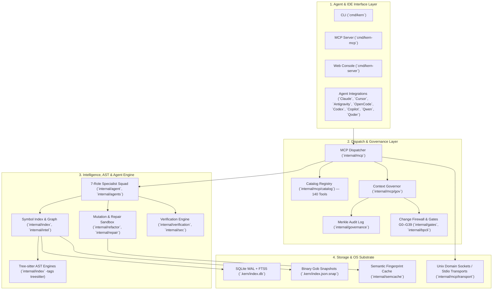

# Kern Architecture & Subsystem Specification

`kern` is a local-first, zero-network context and agent orchestration engine built in Go. It delivers pre-indexed symbol graphs, AST analysis, security and architecture firewall enforcement (Gates G0–G39), and a 7-role specialist agent squad for AI coding assistants.

---

## 1. High-Level System Architecture

The system operates across 4 clean layers with strict dependency rules enforced at compile and test time (`TestArchitectureDocParity`):



---

## 2. The 7-Role Specialist Agent Squad Workflow

Kern embeds 7 specialized agent personas designed to collaborate across the Explore $\rightarrow$ Plan $\rightarrow$ Edit $\rightarrow$ Verify lifecycle:

```mermaid
flowchart LR
    subgraph Phase1["Phase 1: Explore"]
        Planner["Planner<br/>(docs:read, memory:read)"]
        Architect["Architect<br/>(graph:read, boundaries:read)"]
    end

    subgraph Phase2["Phase 2: Plan"]
        PlanMilestone["Blast Radius Matrix<br/>& Phased Plan"]
    end

    subgraph Phase3["Phase 3: Edit"]
        Coder["Coder<br/>(source:write in sandbox)"]
        Tester["Tester<br/>(test synthesis & execution)"]
    end

    subgraph Phase4["Phase 4: Verify"]
        Reviewer["Reviewer<br/>(AST diff review)"]
        Security["Security<br/>(taint & secret scan)"]
        SRE["SRE<br/>(telemetry & incident triage)"]
    end

    Planner --> Architect
    Architect --> PlanMilestone
    PlanMilestone --> Coder
    Coder --> Tester
    Tester --> Reviewer
    Reviewer --> Security
    Security --> SRE
    SRE --> SignedReceipt["Signed CI Attestation Receipt (G0–G39)"]
```



---

## 3. Modular MCP Subsystem Architecture (44 Leaf Subpackages)

The `internal/mcp/` subsystem is completely decomposed into 44 independent leaf packages, ensuring zero monolithic coupling:

```mermaid
graph TD
    Monolith["`internal/mcp` Dispatcher"]

    subgraph CoreNav["Context & Navigation Leaf Packages"]
        direction TB
        graph["`internal/mcp/graph`"]
        doc["`internal/mcp/doc`"]
        retrieve["`internal/mcp/retrieve`"]
        optimize["`internal/mcp/optimize`"]
        contextwatch["`internal/mcp/contextwatch`"]
        crossrepo["`internal/mcp/crossrepo`"]
    end

    subgraph GovSec["Governance & Security Leaf Packages"]
        direction TB
        gov["`internal/mcp/gov`"]
        provenance["`internal/mcp/provenance`"]
        policydsl["`internal/mcp/policydsl`"]
        fingerprint["`internal/mcp/fingerprint`"]
        preedit["`internal/mcp/preedit`"]
    end

    subgraph MutationSand["Mutation & Repair Leaf Packages"]
        direction TB
        refactor["`internal/mcp/refactor`"]
        repair["`internal/mcp/repair`"]
        fragility["`internal/mcp/fragility`"]
        compose["`internal/mcp/compose`"]
    end

    subgraph ExecRuntime["Execution & Agent Control Leaf Packages"]
        direction TB
        agentctl["`internal/mcp/agentctl`"]
        exec["`internal/mcp/exec`"]
        runtime["`internal/mcp/runtime`"]
        flight["`internal/mcp/flight`"]
        stream["`internal/mcp/stream`"]
        transport["`internal/mcp/transport`"]
        catalog["`internal/mcp/catalog`"]
    end

    Monolith --> CoreNav
    Monolith --> GovSec
    Monolith --> MutationSand
    Monolith --> ExecRuntime
```

---

## 4. Architectural Invariants & Parity Enforcement

1. **Parity Testing**: `TestArchitectureDocParity` in `internal/architecture/archdoc_test.go` automatically parses `ARCHITECTURE.md` on every build and CI run.
2. **Fail-Closed Boundaries**: Any new internal Go package must be declared in `ARCHITECTURE.md` with explicit line-of-code caps and permitted internal dependencies.
3. **Zero Cross-Subsystem Leakage**: Leaf subpackages in `internal/mcp/*` are pure, independent modules that do not depend on the monolithic server or create circular dependencies.
