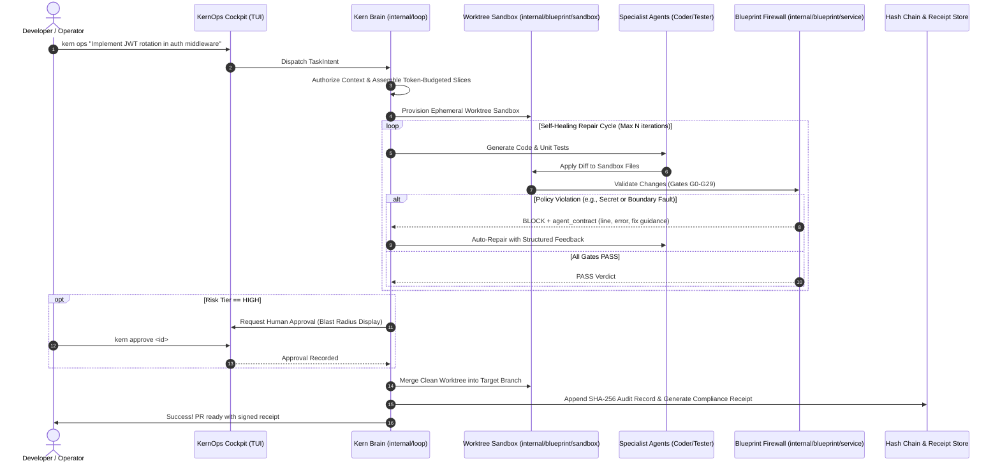

# KernOps: The Governed Autonomous Engineering Platform
## Architecture Blueprint & Implementation Plan

- **Status**: Proposed
- **Author**: Antigravity & Core Team
- **Target Release**: Kern v2.1.0
- **Scope**: Native Orchestration of Governed Autonomous Engineering (`kern loop` + `internal/blueprint`)

---

## 1. Executive Summary & Vision

### 1.1 The Problem: The Perils of Ungoverned AI Coding
Modern autonomous AI coding agents (Devin, Claude Code, Cursor Agent, Copilot Workspace) suffer from critical structural weaknesses when deployed in real-world enterprise codebases:
1. **Live Tree Mutation**: Agents mutate dirty working directories directly. If the agent makes a hallucinated mistake or corrupts syntax, the developer is left with a broken repository state.
2. **Architectural Drift**: LLMs lack global architectural consciousness. They frequently introduce forbidden circular dependencies, bypass domain layering, and create god functions.
3. **Secret & Credential Leaks**: Models routinely generate mock secrets, API keys, or inadvertently log PII that slip past manual code reviews.
4. **Vague, Unstructured Self-Reflection**: When an agent fails, it relies on conversational "self-reflection" prompts (*"Did I make a mistake?"*), burning massive token budgets with low convergence rates.
5. **Zero Supply Chain Attestation**: Regulated industries (SOC 2, ISO 27001, HIPAA, FinTech) require cryptographic proof of who authored code, which gates were passed, and whether human oversight was enforced.

### 1.2 The Solution: KernOps
**KernOps** is a **local-first, zero-trust autonomous engineering platform** built directly upon the unified `kern` engine. It pairs:
- **The Brain (`kern`)**: AST symbol indexing, call graphs, context optimization (-80% tokens), log squeezing (-60% tokens), specialist agent rosters (Architect, Coder, Tester, Reviewer), and the autonomous loop engine ($L_0$ to $L_5$).
- **The Immune System (`internal/blueprint`)**: Deterministic policy enforcement, 30 phase gates ($G_0$–$G_{29}$), ephemeral git worktree sandboxes, structured machine-actionable repair contracts (`agent_contract`), two-person approval gates, and tamper-evident SHA-256 audit trails.

KernOps establishes **Governed Autonomy**: agents are free to plan and write code aggressively, but they execute strictly within ephemeral sandboxes, receive deterministic compiler/linter/gate repair feedback, and can never merge code into production branches without clearing all governance policies.

---

## 2. Packaging & Repository Architecture: Standalone Sibling Project (Option 2)

KernOps is architected as a **separate, dedicated sibling repository** (`/workspace/kernops`), distinct from the core `kern` engine:

```
/workspace/
├── kern/               # Core Engine: Symbol Index, AST, Loop L0-L5, Blueprint Gates G0-G29
└── kernops/            # Standalone Orchestrator & Cockpit: TUI, Event Mesh, SRE/Autonomy Workflows
```

### 2.1 Why a Separate Repository (`kernops`)
1. **Zero Dependency Pollution in Core Engine**:
   - `kern` remains a lean, stdlib-first, high-performance Go binary without heavy graphical or terminal framework dependencies.
   - `kernops` freely imports modern TUI frameworks (`charmbracelet/bubbletea`, `lipgloss`, `bubbles`) and web socket / dashboard dependencies without bloating `kern`'s `go.mod`.
2. **Decoupled Release Cadence & Versioning**:
   - `kern` versions as a headless core engine (`v2.x`).
   - `kernops` versions as an interactive user-facing developer application and platform (`v1.x`), allowing rapid UI iteration without triggering engine rebuilds.
3. **Clean Interface Contracts**:
   - `kernops` interacts with `kern` through two clean, versioned contracts:
     - **In-process Go Module API**: Imports `github.com/JayveerPrajapati/kern/internal/loop` and `github.com/JayveerPrajapati/kern/internal/blueprint` for sub-millisecond execution.
     - **External MCP & Socket Interface**: Connects via `kern-mcp` (stdio / JSON-RPC 2.0) and Unix domain socket event relay (`.kern/events.sock`) for language-agnostic extensibility.
4. **Workspace Ecosystem Alignment**:
   - Integrates seamlessly alongside sibling projects in the workspace (such as `PatchPilot`, `auto_sre`, and `blueprint`).

---

## 3. System Architecture & Component Model

```
┌────────────────────────────────────────────────────────────────────────────────────────┐
│                                   KERNOPS CLIENTS                                      │
│         Terminal Cockpit (`kernops` / TUI)    │       Web Console / Studio UI         │
└───────────────────────────────────────────┬────────────────────────────────────────────┘
                                            │ Task Prompt / Command
                                            ▼
┌────────────────────────────────────────────────────────────────────────────────────────┐
│                              KERNOPS ORCHESTRATION ENGINE                              │
│                                                                                        │
│  ┌──────────────────────────────────────────────────────────────────────────────────┐  │
│  │ 1. BRAIN: KERN CONTEXT & PLANNING RUNTIME (`internal/loop`, `internal/agents`)   │  │
│  │  • Authorized Context Verification (`kern_authorize_context`)                    │  │
│  │  • Graph-Guided Context Slicing (`internal/budget`, `internal/context`)          │  │
│  │  • Intent Classification & Risk Tiering (`internal/governance`, `internal/risk`) │  │
│  │  • Specialist Team Coordination: Architect ──► Coder ──► Tester                  │  │
│  └────────────────────────────────────────┬─────────────────────────────────────────┘  │
│                                           │ Dispatches sandboxed tasks                 │
│                                           ▼                                            │
│  ┌──────────────────────────────────────────────────────────────────────────────────┐  │
│  │ 2. SANDBOX: EPHEMERAL WORKTREE ISOLATION (`internal/blueprint/sandbox`)          │  │
│  │  • Isolated Git Worktree per task (zero risk to working tree)                     │  │
│  │  • Optional Network & Process Namespacing (`netns_linux`, `procgroup_unix`)       │  │
│  │  • Surgical AST Edits & Test Generation inside Sandbox                            │  │
│  └────────────────────────────────────────┬─────────────────────────────────────────┘  │
│                                           │ Proposed patch / diff                      │
│                                           ▼                                            │
│  ┌──────────────────────────────────────────────────────────────────────────────────┐  │
│  │ 3. IMMUNE SYSTEM: CHANGE FIREWALL & REPAIR LOOP (`internal/blueprint/service`)   │  │
│  │  • Gates G0–G29 (Secrets, Boundaries, Duplication, Tests, Resilience, Approvals) │  │
│  │  • Machine-Actionable Feedback: `agent_contract.is_actionable = true`            │  │
│  │  • Closed-Loop Auto-Repair: Feeds line-specific guidance back to Coder agent     │  │
│  └────────────────────────────────────────┬─────────────────────────────────────────┘  │
│                                           │ Passes all gates                           │
│                                           ▼                                            │
│  ┌──────────────────────────────────────────────────────────────────────────────────┐  │
│  │ 4. HUMAN-IN-THE-LOOP APPROVAL GATE (`internal/blueprint/approval`)               │  │
│  │  • High-risk modifications (crypto, billing, public API) require sign-off        │  │
│  │  • Terminal / UI interactive prompt showing blast radius & impact                │  │
│  └──────────────────────────────────────────────────────────────────────────────────┘  │
└───────────────────────────────────────────┬────────────────────────────────────────────┘
                                            │ Emits telemetry & signed proofs
                                            ▼
┌────────────────────────────────────────────────────────────────────────────────────────┐
│                         PROVENANCE & AUDIT TRAIL LAYER                                 │
│  • Event Mesh Unix Socket Relay: `.kern/events.sock`                                   │
│  • Cryptographic Tamper-Evident SHA-256 Hash Chain: `internal/storage/chain.jsonl`     │
│  • Compliance Proof Receipt: `internal/blueprint/receipt` (SARIF / in-toto compatible) │
│  • Long-Term Engineering Memory: `internal/memory` (`kern remember`)                   │
└────────────────────────────────────────────────────────────────────────────────────────┘
```

---

## 4. The 5-Stage Governed Execution Lifecycle



### Stage Details

#### 1. Scope & Context Assembly (`Brain`)
- **Authorized Context Enforcement**: Invokes `kern_authorize_context` with the task description. Identifies allowed packages, entry points, and forbidden cross-boundary files.
- **AST Slicing**: Queries `internal/codegraph` and `internal/budget` to construct minimal code slices, eliminating 70–80% of unnecessary file tokens.
- **Boundary Pre-Scan**: Evaluates `.kern/boundaries.json` to verify that the proposed feature design is architecturally valid before generating any code.

#### 2. Ephemeral Worktree Isolation (`Sandbox`)
- Spawns an isolated git worktree under `.kern/sandboxes/<task-id>/`.
- Ensures zero modification to the user's active branch or unstaged working tree.
- Configures process isolation and restricted networking where applicable (`procgroup_unix`, `netns_linux`).

#### 3. Closed-Loop Gate Evaluation & Self-Repair (`Firewall`)
The code inside the worktree is validated in-process against Blueprint gates:
- **Gate G1 (Secrets)**: AST regex scanner + `gitleaks` contract check.
- **Gate G2 (Architecture Boundaries)**: Validates package imports against `.kern/boundaries.json` using `kern guard`.
- **Gate G6 (Duplication)**: Analyzes AST clone tokens and `jscpd` similarity metrics.
- **Gate G8 (Isolated Build & Test)**: Compiles the worktree and executes `go test -race ./...` in sandbox isolation.
- **Gate G9 (Resilience)**: Evaluates fault-injection and boundary condition tests.

**The Self-Repair Contract**:
When any gate returns `BLOCK`, the engine does not abort. It constructs an `agent_contract`:
```json
{
  "is_actionable": true,
  "check": "boundary",
  "file": "internal/auth/middleware.go",
  "line": 42,
  "violation": "package auth cannot import internal/database directly",
  "suggested_fix": "use interface auth.UserRepository instead of database.Client"
}
```
The contract is fed directly back into `internal/coder`. The agent executes up to $N$ automatic repair iterations (default $N=3$) until all gates pass.

#### 4. Governance & Human-in-the-Loop Sign-Off (`Approval`)
- Tasks are classified into Risk Tiers: `LOW`, `MEDIUM`, `HIGH`, `CRITICAL`.
- Safe refactors, doc updates, and test additions (`LOW`/`MEDIUM`) proceed autonomously.
- Architectural modifications, auth changes, and billing logic (`HIGH`/`CRITICAL`) trigger an interactive pause:
  - The Cockpit highlights blast radius, impacted callers, and affected routes.
  - Requires explicit sign-off via `kern approve <task-id>` or TUI keystroke.

#### 5. Attestation, Merge & Long-Term Memory (`Audit & Receipt`)
- The clean sandbox branch is merged cleanly into the designated target branch.
- Emits an immutable, cryptographically signed compliance receipt (`kern verify-receipt`) containing:
  - Task identity & model provider
  - Git commit hash & worktree fingerprint
  - Gate verdicts ($G_0$–$G_{29}$)
  - Approver identity & timestamp
- The transaction is appended to `internal/storage/chain.jsonl` with SHA-256 integrity hashing.
- Kern's engineering memory is updated (`internal/memory`) so subsequent runs benefit from architectural patterns learned.

---

## 5. Implementation Roadmap

### Phase 1: In-Process Engine Bridge (`kern loop` + `internal/blueprint`)
* **Goal**: Unify `internal/loop/loop.go` with `internal/blueprint/service/validate.go` without CLI subprocess overhead.
* **Deliverables**:
  1. Create `internal/loop/firewall_adapter.go`:
     - Implements `loop.ProtectStage` and `loop.VerifyStage` interfaces by directly invoking `blueprint.ValidateService`.
  2. Implement closed-loop auto-repair logic in `internal/loop/loop.go`:
     - When `ValidationResult.Verdict == VerdictBlock`, map `Findings` to structured repair prompts for `internal/coder`.
     - Cap retries at configurable limit (`MaxRepairAttempts = 3`).
  3. Wire worktree isolation:
     - Connect `internal/blueprint/sandbox.WorktreeManager` to `execution.Worktree` in `internal/execution/`.
* **Testing**: Add integration tests in `internal/loop/governed_loop_test.go` verifying that a deliberate boundary violation triggers auto-repair and passes on iteration 2.

### Phase 2: Event Bus & Real-Time Telemetry Streaming
* **Goal**: Enable real-time progress streaming for terminal and web cockpits.
* **Deliverables**:
  1. Extend `internal/eventbus` with KernOps events:
     - `EventTaskStarted`, `EventPlanFormed`, `EventSandboxReady`, `EventGateEvaluated`, `EventRepairAttempt`, `EventApprovalRequested`, `EventTaskCompleted`.
  2. Emit events from `internal/loop` and `internal/blueprint/service` to the Unix domain socket relay (`.kern/events.sock`).
  3. Expose JSON-lines SSE endpoint on Kern's web server (`internal/web/server.go`) for remote observability.
* **Testing**: Verify event sequence in `internal/eventbus/relay_test.go`.

### Phase 3: The Standalone Terminal Cockpit (`kernops` TUI Repo)
* **Goal**: Scaffold the standalone `/workspace/kernops` repository and deliver the interactive TUI.
* **Deliverables**:
  1. Initialize `/workspace/kernops` with `cmd/kernops/main.go`.
  2. Implement a multi-pane TUI using `charmbracelet/bubbletea` and `lipgloss`:
     - **Pane 1 (Phases)**: Status stepper (`INTENT` ➔ `PLAN` ➔ `CODE` ➔ `FIREWALL` ➔ `VERIFY` ➔ `RECEIPT`).
     - **Pane 2 (Live Sandbox Diff)**: High-speed streaming unified diff view of the active worktree.
     - **Pane 3 (Gate Grid)**: Real-time matrix of gates ($G_0$ to $G_{29}$) with pass/fail/repair badges.
     - **Pane 4 (Approval & Cost Meter)**: Human-in-the-loop prompt with token usage and cost tracking.
  3. Support headless mode (`kernops --non-interactive "prompt"`) for automated CI runs.
* **Testing**: Add snapshot and mock TUI runner tests in `kernops`.

### Phase 4: Incident Triage & Self-Healing Mode ("Auto-SRE")
* **Goal**: Empower KernOps to autonomously diagnose, reproduce, and fix CI failures and incident reports.
* **Deliverables**:
  1. Implement `kernops triage --log <path-or-stdin>`:
     - Compresses raw logs with `internal/squeezer` (-60% token reduction).
     - Correlates stack traces with AST symbols using `internal/codegraph`.
     - Spawns an isolated sandbox to write a failing reproduction unit test.
     - Enters the repair loop until the reproduction test and all Blueprint gates pass.
  2. Wire with `internal/incident` and `internal/correlate`.
* **Testing**: E2E test feeding a mock panic stack trace and verifying clean bugfix in sandbox.

### Phase 5: CI Attestation & Cryptographic Supply Chain
* **Goal**: Turn KernOps into an auditable compliance gate for pull requests.
* **Deliverables**:
  1. Enhance `kern verify-receipt` to export:
     - SARIF output format for GitHub Code Scanning tab integration.
     - In-toto v0.2 supply-chain attestation bundle.
  2. Provide pre-packaged GitHub Action: `.github/workflows/kernops-gate.yml`.
  3. Add tamper-detection check verifying that the PR diff strictly matches the cryptographic fingerprint signed in the receipt.
* **Testing**: Complete CI workflow test simulating PR validation and attestation verification.

---

## 6. Technical Specifications & Contracts

### 6.1 Auto-Repair Contract Schema
When a Blueprint check fails, it produces a structured payload for the Coder agent:

```go
type RepairContract struct {
    TaskID       string           `json:"task_id"`
    Iteration    int              `json:"iteration"`
    GateID       string           `json:"gate_id"`       // e.g. "G2_BOUNDARIES"
    CheckType    string           `json:"check_type"`    // e.g. "boundary"
    IsActionable bool             `json:"is_actionable"` // true
    TargetFile   string           `json:"target_file"`   // e.g. "internal/auth/middleware.go"
    LineNumber   int              `json:"line_number"`   // e.g. 42
    RuleName     string           `json:"rule_name"`     // e.g. "disallow_db_in_handlers"
    RawMessage   string           `json:"raw_message"`   // Human readable error
    SuggestedFix string           `json:"suggested_fix"` // Contextual advice
    ContextSlice string           `json:"context_slice"` // AST-minimal code slice
}
```

### 6.2 Verification Receipt Schema
The output generated by `kern verify-receipt` following task execution:

```json
{
  "receipt_version": "2.0.0",
  "task_id": "task_20260904_auth_jwt",
  "timestamp": "2026-09-04T03:52:00Z",
  "provenance": {
    "engine": "kernops-v2.1.0",
    "git_base_sha": "a1b2c3d4e5f6...",
    "git_head_sha": "f6e5d4c3b2a1...",
    "agent_id": "specialist-coder-01",
    "model": "claude-3-7-sonnet"
  },
  "gate_verdicts": {
    "G1_SECRETS": "PASS",
    "G2_BOUNDARIES": "PASS",
    "G6_DUPLICATION": "PASS",
    "G8_SANDBOX_TESTS": "PASS",
    "G9_RESILIENCE": "PASS",
    "G24_APPROVAL": "PASS"
  },
  "approval": {
    "required": true,
    "approver": "lead-engineer@corp.internal",
    "approval_id": "appr_987123",
    "signed_at": "2026-09-04T03:55:12Z"
  },
  "tamper_proof": {
    "chain_index": 142,
    "chain_sha256": "8f4b23c901e...",
    "signature": "MEQCIA..."
  }
}
```

---

## 7. Success Metrics & Verification Criteria

| Dimension | Target Metric | Measurement Method |
|---|---|---|
| **Zero Repository Corruption** | 100% of failed/aborted tasks leave zero changes on active branch | Test suite executing deliberate aborts; verify `git status` clean |
| **Self-Healing Convergence** | $\ge 80\%$ of boundary and lint violations auto-repaired within 3 iterations | Synthetic test suite injecting boundary violations |
| **Token Efficiency** | $\ge 65\%$ token savings compared to raw-file agents | Benchmark tokens consumed on identical refactoring tasks |
| **Gate Enforcement** | $0$ bypasses of `boundaries.json` or detected secrets | Negative security test suite attempting unauthorized imports/secrets |
| **Audit Verifiability** | 100% of receipts verifiable via `kern verify-receipt` offline | Cryptographic signature & hash chain verification |

---

## 8. Immediate Next Actions

1. **Sprint 1 (Engine)**: Implement `internal/loop/firewall_adapter.go` and the `RepairContract` feedback loop.
2. **Sprint 2 (Isolation)**: Wire `execution.Worktree` directly to `internal/blueprint/sandbox`.
3. **Sprint 3 (UI & Repo)**: Scaffold the `/workspace/kernops` standalone repository and Bubbletea TUI prototype.
4. **Sprint 4 (CI)**: Package the GitHub Action and SARIF receipt exporter.
